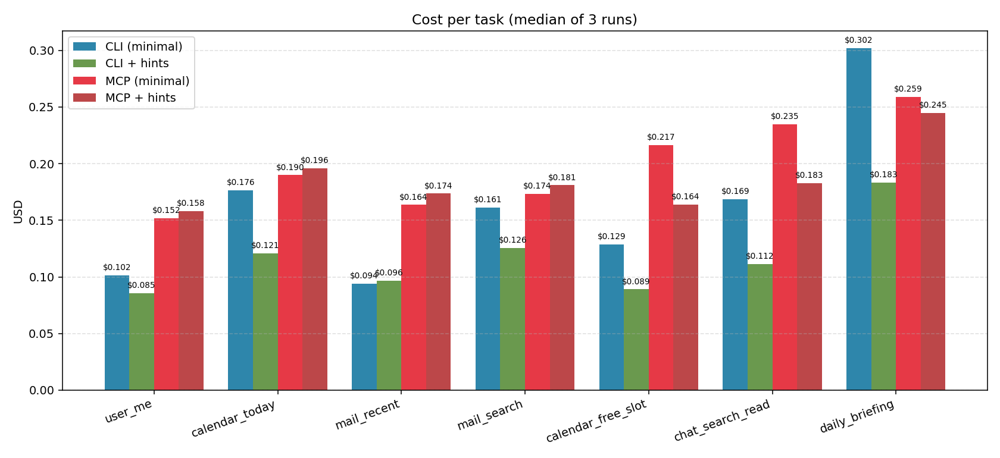
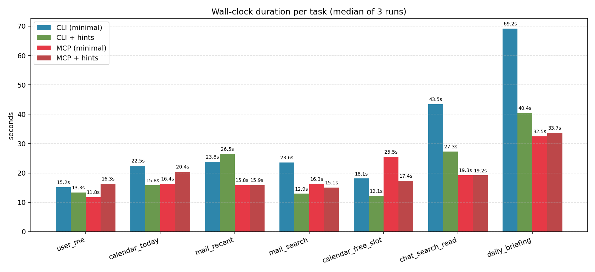
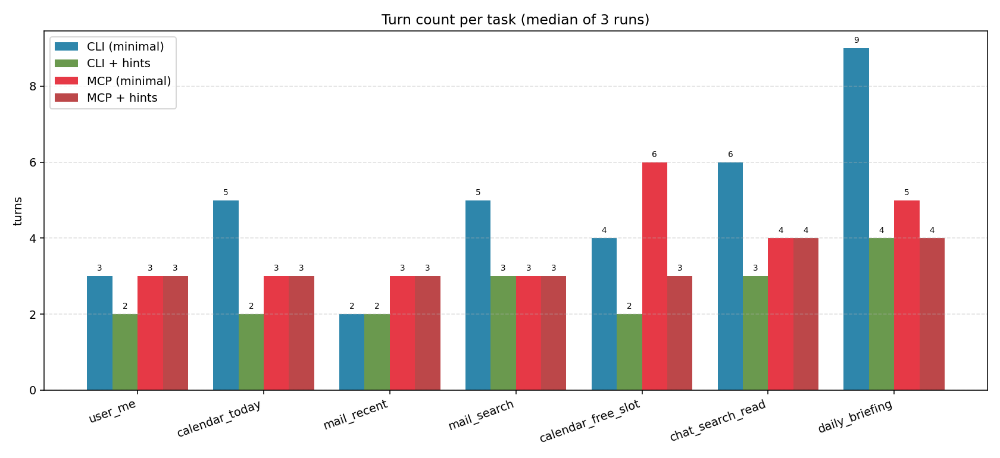
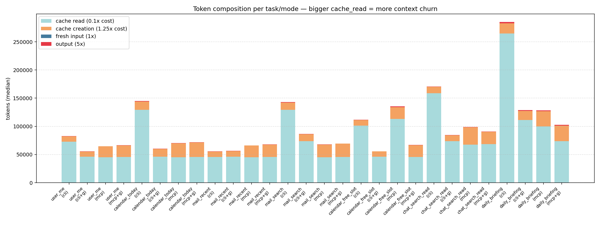
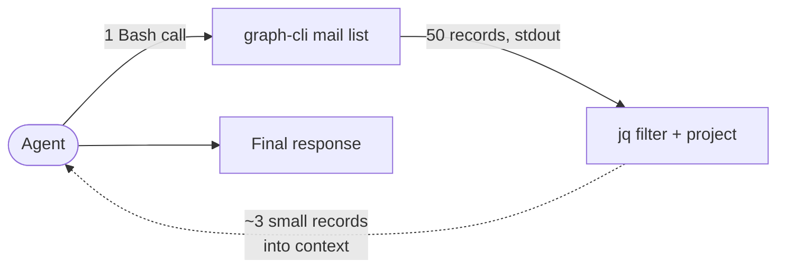
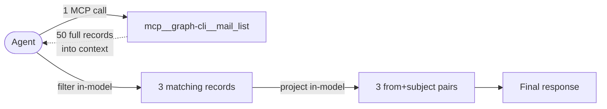
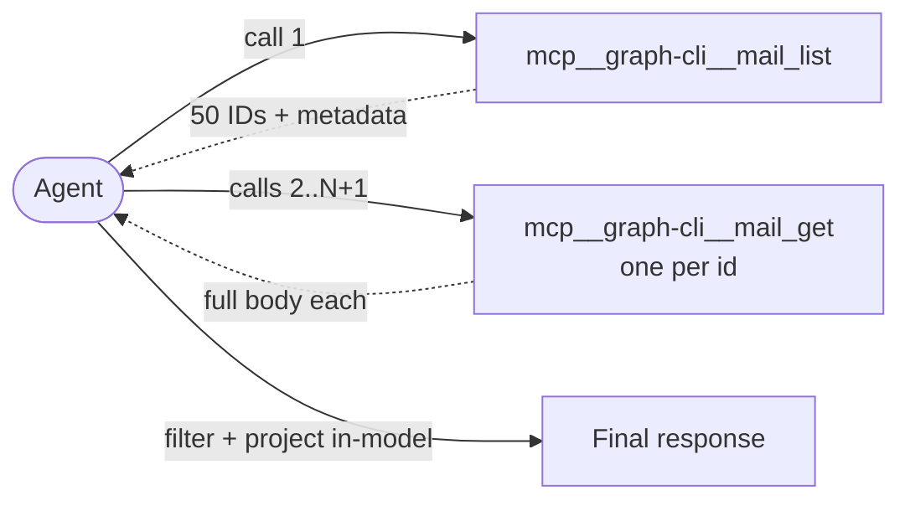

# graph-cli: CLI vs MCP Token Usage Benchmark

Measurement of `graph-cli` invoked in up to four configurations on the same read-only tasks:

- **CLI (minimal)** — `graph-cli` via the Bash tool, minimal system prompt ("use graph-cli via Bash").
- **CLI + hints** — Bash surface, system prompt includes a cookbook of common read-only commands for the benchmarked tasks.
- **MCP (minimal)** — `graph-cli mcp` stdio MCP server, tools prefixed `mcp__graph-cli__`, minimal system prompt.
- **MCP + hints** — same MCP surface, system prompt includes a task-to-tool cookbook.

Same underlying tool and Microsoft Graph APIs — only the tool surface and priming differ.

## Totals

| Metric | CLI (minimal) | CLI + hints | MCP (minimal) | MCP + hints |
|---|---|---|---|---|
| Total cost (21 runs each) | $3.54 | $2.45 | $4.25 | $3.95 |
| Total wall time | 665s | 452s | 417s | 412s |
| Total turns | 104 | 54 | 82 | 69 |
| Total output tokens | 16644 | 9423 | 13745 | 11267 |
| Cost per turn | $0.0340 | $0.0453 | $0.0519 | $0.0573 |
| Duration per turn | 6.4s | 8.4s | 5.1s | 6.0s |


## Methodology

- **7 read-only tasks** across graph-cli surfaces (user, mail, calendar, chat).
- **3 runs** per task/mode. Totals in tables are summed across runs; per-task values are medians.
- Each run is a fresh `claude -p` process from a clean temp CWD. `CLAUDE.md` auto-discovery is disabled. System prompt differs only in the surface the agent is told to use (Bash vs MCP) and whether a task-to-command cookbook is included.
- `--strict-mcp-config` restricts available MCP servers to the configured `graph-cli` server. `--allowed-tools` / `--disallowed-tools` restrict the tool surface to the mode under test.
- Token, cost, and duration figures are taken from Claude's `--output-format json` usage envelope.
- 5-second delay between runs to avoid Graph API throttling.

## Per-task cost comparison



## Per-task latency



## Per-task turn count



## Token composition



Observed: CLI modes accumulate larger `cache_read` token volumes than MCP modes. Each Bash call returns raw JSON into the transcript, which becomes part of the cached prefix and is read again on each subsequent turn. MCP's tool schema catalog contributes to higher one-time `cache_creation` tokens, but the per-turn input size is smaller in these runs.

## Latency decomposition

Total wall time — bare CLI: **665s**, MCP: **417s** (ratio 1.60x). The gap decomposes into two factors:

1. **Turn count.** Bare CLI used 104 turns; MCP used 82 (+27%). Each additional turn is an additional model round-trip. Transcript inspection shows Bash-mode turns include occasional `--help` exploration and command re-reads; MCP-mode turns invoke tools directly from pre-loaded schemas.
2. **Per-turn duration.** Bare CLI: 6.4s/turn; MCP: 5.1s/turn (ratio 1.26x). Contributing factors observed in the data and implementation:
    - **Process spawn per call.** Each Bash invocation starts a new `graph-cli.exe` process, including .NET runtime initialization, token-cache read, and HTTP client construction. The MCP server is spawned once per session; subsequent tool calls reuse the process, auth context, and HTTP connections.
    - **Input tokens per turn.** CLI turns carry more cached context (JSON output of prior calls), which increases the tokens the model processes on each turn.
    - **Output tokens per turn.** CLI responses in the final assistant message tend to include or restate more JSON content than MCP responses.

Adding task-to-command hints to the system prompt reduces turn count for both surfaces but does not affect per-turn process-spawn overhead or context size, which are properties of the surface itself.

## Surface-specific capabilities: compound operations

The Bash surface supports shell composition — piping output between programs, filtering with `jq`, selecting fields, aggregating. The MCP surface does not; each tool call returns a full response into the model's context, and any filter/transform logic runs in the model itself.

This difference is not exercised by the benchmarked tasks above (they request full records) but it is relevant for realistic workflows. A worked example:

**Task:** "From my last 50 Inbox emails, list just the sender and subject of any whose body mentions 'invoice'."

*Bash path — 1 tool call:*

```bash
graph-cli mail list --top 50 --folder Inbox --timezone "Asia/Karachi" \
  | jq '[.[] | select(.bodyPreview|test("invoice";"i")) | {from: .from.emailAddress.address, subject}]'
```



What enters context: only the filtered and projected records. If 3 of 50 emails match, the model sees ~3 small JSON objects.

*MCP path — 1 tool call, filter and project in-model:*

```
# Step 1 — tool call (returns all 50 records into context)
mcp__graph-cli__mail_list(
    top: 50,
    folder: "Inbox",
    timezone: "Asia/Karachi"
)

# Step 2 — model-side (no tool call, but all 50 records consumed as input tokens)
# iterate records, keep where bodyPreview matches /invoice/i

# Step 3 — model-side projection, emitted in the final assistant message
# for each match: { from: from.emailAddress.address, subject: subject }
```



What enters context: all 50 full email records. The model performs the filter and projection itself — those steps cost input tokens (re-reading the 50 records) and output tokens (writing the filtered list) rather than additional tool calls.

If the required filter field is not present in the `mail_list` response (e.g., matching on full message body rather than `bodyPreview`), the MCP path must fall back to a list-then-get-per-id pattern:

```
mcp__graph-cli__mail_list(top: 50, folder: "Inbox", ...)
mcp__graph-cli__mail_get(id: "<id-1>")
mcp__graph-cli__mail_get(id: "<id-2>")
...  # up to one per message
```



The Bash pipeline absorbs this case without extra round-trips because the shell can filter the full list in-process before returning to the model.

Order-of-magnitude comparison on the example above (with 50 emails × ~500 tokens per full record ≈ 25,000 tokens of tool output versus ~200 tokens of `jq`-filtered output): the Bash path can avoid ~24KB of input tokens reaching the model on that turn, at the cost of constructing a `jq` expression in the Bash command.

Implications:

- For workloads dominated by *filter/project/aggregate over list responses*, the Bash surface can be materially cheaper than MCP because the model never sees the filtered-out records.
- For workloads dominated by *single-resource lookups and structured action calls*, the surfaces are roughly equivalent on data volume, and MCP's per-turn latency advantages apply.
- None of the benchmark tasks use `jq`-style filtering; results in the tables above do not reflect this advantage.

## Full data (medians)

| Task | Mode | Cost | Dur (s) | Turns | In tok | Out tok | Cache create | Cache read |
|---|---|---|---|---|---|---|---|---|
| user_me | cli | $0.1015 | 15.2 | 3 | 8 | 267 | 9264 | 72952 |
| user_me | cli_guided | $0.0855 | 13.3 | 2 | 7 | 159 | 9294 | 45938 |
| user_me | mcp | $0.1518 | 11.8 | 3 | 13 | 226 | 19690 | 44959 |
| user_me | mcp_guided | $0.1579 | 16.3 | 3 | 13 | 220 | 20673 | 45451 |
| calendar_today | cli | $0.1764 | 22.5 | 5 | 10 | 754 | 14788 | 129197 |
| calendar_today | cli_guided | $0.1207 | 15.8 | 2 | 7 | 398 | 13970 | 45956 |
| calendar_today | mcp | $0.1899 | 16.4 | 3 | 13 | 505 | 24662 | 45210 |
| calendar_today | mcp_guided | $0.1961 | 20.4 | 3 | 13 | 497 | 25646 | 45705 |
| mail_recent | cli | $0.0940 | 23.8 | 2 | 7 | 385 | 9784 | 45528 |
| mail_recent | cli_guided | $0.0965 | 26.5 | 2 | 7 | 369 | 10210 | 45947 |
| mail_recent | mcp | $0.1636 | 15.8 | 3 | 13 | 431 | 20761 | 45103 |
| mail_recent | mcp_guided | $0.1736 | 15.9 | 3 | 13 | 508 | 22023 | 45597 |
| mail_search | cli | $0.1611 | 23.6 | 5 | 10 | 603 | 12928 | 129375 |
| mail_search | cli_guided | $0.1255 | 12.9 | 3 | 8 | 413 | 12446 | 73818 |
| mail_search | mcp | $0.1735 | 16.3 | 3 | 13 | 362 | 22617 | 45082 |
| mail_search | mcp_guided | $0.1809 | 15.1 | 3 | 13 | 396 | 23639 | 45578 |
| calendar_free_slot | cli | $0.1286 | 18.1 | 4 | 9 | 608 | 9910 | 101175 |
| calendar_free_slot | cli_guided | $0.0890 | 12.1 | 2 | 7 | 269 | 9411 | 45977 |
| calendar_free_slot | mcp | $0.2166 | 25.5 | 6 | 21 | 1103 | 21109 | 113091 |
| calendar_free_slot | mcp_guided | $0.1640 | 17.4 | 3 | 13 | 364 | 21039 | 45659 |
| chat_search_read | cli | $0.1685 | 43.5 | 6 | 11 | 718 | 11315 | 158701 |
| chat_search_read | cli_guided | $0.1115 | 27.3 | 3 | 8 | 389 | 10300 | 73798 |
| chat_search_read | mcp | $0.2347 | 19.3 | 4 | 14 | 447 | 31074 | 67372 |
| chat_search_read | mcp_guided | $0.1829 | 19.2 | 4 | 14 | 445 | 21933 | 68372 |
| daily_briefing | cli | $0.3020 | 69.2 | 9 | 14 | 2308 | 17796 | 264974 |
| daily_briefing | cli_guided | $0.1832 | 40.4 | 4 | 9 | 1046 | 16142 | 111392 |
| daily_briefing | mcp | $0.2587 | 32.5 | 5 | 20 | 1540 | 27006 | 99897 |
| daily_briefing | mcp_guided | $0.2449 | 33.7 | 4 | 14 | 1337 | 27884 | 73503 |

## Observations

- **Lowest total cost:** CLI + hints ($2.45).
- **Lowest total wall time:** MCP + hints (412s).
- **Fewest total turns:** CLI + hints (54).
- Adding task-to-command hints reduced CLI total cost by 31% ($3.54 → $2.45) and CLI total turns by 48%.
- Adding task-to-tool hints reduced MCP total cost by 7% ($4.25 → $3.95) and MCP total turns by 16%.
- Per-turn cost is lower for CLI modes than MCP modes in these runs. Per-turn duration is lower for MCP modes.
- Output token totals are smaller for MCP modes than CLI modes. Contributing factor observed in transcripts: Bash-mode final responses more often restate JSON fields from tool output.

## Caveats

- N = 3 per (task, mode) cell. Variance is not fully captured; larger N would tighten the estimates.
- Claude API latency varies across time of day and API traffic. Comparing runs across different days or hours introduces noise unrelated to the surface under test.
- All runs used the same model. Results with smaller or larger models may differ in both shape and magnitude.
- The hinted-mode system prompts used here are condensed cookbooks (~20-30 lines). Production workflow documentation is typically longer and more task-specific.
- Only read-only tasks were benchmarked. Write operations involve confirmation loops that may shift the profile.
- Results reflect the volume of data present in the test mailbox/calendar at run time. Sparse inboxes produce smaller responses than busy ones.
