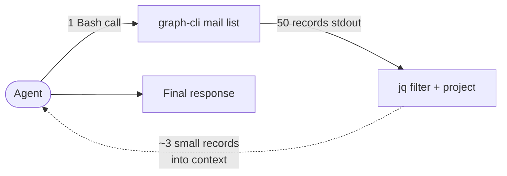
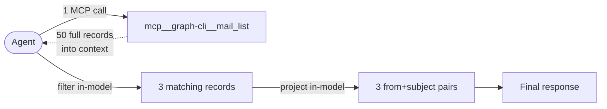
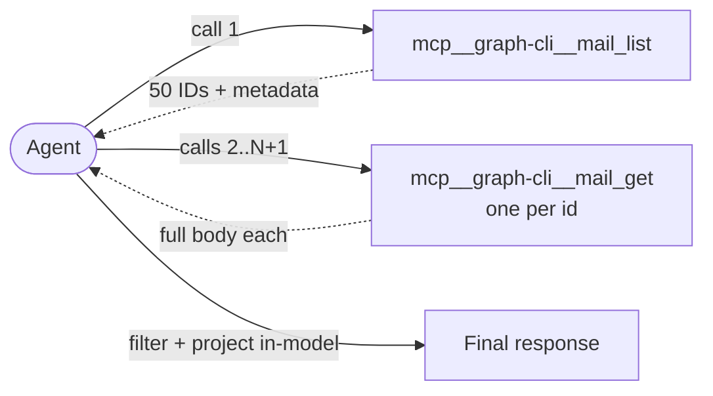

# Comparative Analysis of CLI and MCP Tool Surfaces for Agentic Microsoft Graph Access

**Run label:** Monday 2026-04-20, afternoon PKT  
**Configurations:** 4 (CLI (minimal), CLI + hints, MCP (minimal), MCP + hints)  
**Tasks:** 7 read-only Microsoft Graph operations  
**Replicates:** 3 runs per (task, configuration) cell  

---

## Abstract

We evaluate four configurations of a Microsoft Graph tool (`graph-cli`) exposed to a large language model agent: the tool invoked as a command-line program through a generic shell tool (CLI), and the same tool exposed as a Model Context Protocol (MCP) server, each tested with a minimal system prompt and with a task-to-command cookbook in the system prompt. The agent executes 7 read-only tasks spanning user identity, mail, calendar, and chat surfaces, with 3 replicates per cell. We report aggregate cost, wall-clock latency, turn count, and token composition from Claude's usage envelope. Across all tasks, the lowest total cost is observed for CLI + hints ($2.45), the lowest total wall-clock time for MCP + hints (412s), and the lowest total turn count for CLI + hints (54 turns). We decompose the latency gap into turn count and per-turn duration, and discuss a structural capability available to the CLI surface (shell composition via pipes) that is not exercised by the benchmarked tasks but is relevant to realistic workloads.

## 1. Introduction

Language model agents increasingly interact with enterprise systems through external tools. Two common integration patterns are (a) invoking a conventional CLI binary through a generic shell tool made available to the agent, and (b) exposing the same functionality through a Model Context Protocol (MCP) server, which the agent calls with structured arguments. Both patterns are widely used in production agent configurations, and practitioners frequently ask which pattern is preferable for a given workload.

We compare the two surfaces using `graph-cli`, an open-source tool that exposes Microsoft Graph (email, calendar, Teams chat, user directory, files) through both a CLI and a built-in MCP server with (per its documentation) 1:1 command parity. Because the underlying API calls and authentication are identical, any measured differences are attributable to the tool surface rather than the business logic.

We also test the effect of in-prompt priming. Production agent systems often include task-to-command cookbooks in their system prompts or in auto-loaded context files. We compare a minimal prompt ("use graph-cli via Bash" / "use graph-cli MCP tools") against a prompt containing a condensed cookbook covering the benchmarked tasks.

## 2. Background

### 2.1 The two tool surfaces

In CLI mode, the agent invokes `graph-cli` through a generic Bash tool. Each call spawns a fresh process: the .NET runtime is initialized, a cached access token is read from disk, an HTTP client is constructed, a request is sent to Microsoft Graph, and the JSON response is written to standard output. The stdout text is returned verbatim to the agent.

In MCP mode, the agent's harness spawns `graph-cli mcp` once per session as a long-lived stdio-based server. The agent invokes individual tools by name (e.g. `mail_list`) with structured arguments. The server reuses its process state, access token, and HTTP client across calls. Tool schemas are provided to the agent at session start, enabling structured argument validation and pre-loaded knowledge of available operations.

### 2.2 Prompt priming

In addition to the surface choice, an operator can prime the agent with task-specific guidance: which command or tool to use for which kind of request, plus invocation hints (timezones, filters, pagination). We treat this as a second independent factor, giving a 2×2 design yielding 4 configurations evaluated in this study.

## 3. Methodology

### 3.1 Task suite

Seven read-only tasks were selected to span common Graph operations and to vary in complexity from a single-call lookup to a multi-step briefing that requires combining results from multiple endpoints:

| ID | Complexity | Description |
|---|---|---|
| user_me | trivial | Return the authenticated user's display name and email. |
| calendar_today | simple | List today's calendar events with start time and subject. |
| mail_recent | simple | List the 10 most recent Inbox emails with sender and subject. |
| mail_search | medium | Find the most recent email matching a sender/subject term. |
| calendar_free_slot | medium | Check availability of a room mailbox in a time window. |
| chat_search_read | medium | Locate a Teams chat by topic and read recent messages. |
| daily_briefing | complex | Combine today's calendar events and unread emails into a briefing; flag conflicts. |

### 3.2 Experimental setup

Each cell of the 4×7 design was executed with N = 3 replicates. Each run is a fresh subprocess invocation of `claude -p <prompt> --output-format json` from a newly created temporary working directory. Settings:

- `CLAUDE.md` auto-discovery is suppressed by running from an empty CWD, ensuring no project-specific context is injected.
- `--strict-mcp-config` restricts the agent to the explicitly configured MCP server set. In CLI configurations, the MCP server set is empty; in MCP configurations, only `graph-cli` is configured.
- `--allowed-tools` and `--disallowed-tools` gate the tool surface: CLI configurations permit Bash only; MCP configurations permit only the `mcp__graph-cli__*` namespace.
- `--permission-mode bypassPermissions` auto-approves tool calls for automation, paired with a read-only instruction in the system prompt.
- A 5-second delay is inserted between consecutive runs to avoid throttling on the Graph API.

System prompts differ only in (a) which surface the agent is told to use, and (b) whether a condensed command-to-task cookbook is included. Both minimal and hinted prompts instruct the agent to avoid parallel tool invocations (the graph-cli token cache is not concurrency-safe).

### 3.3 Measurements

For each run we record the fields of Claude's `--output-format json` result envelope: `input_tokens`, `output_tokens`, `cache_creation_input_tokens`, `cache_read_input_tokens`, `total_cost_usd`, `num_turns`, and `duration_ms`. Wall-clock duration is also measured externally by the benchmark harness. All table values labeled "total" are sums across the 21 runs in a configuration; per-task values in Section 4 are medians across 3 replicates.

## 4. Results

### 4.1 Aggregate totals


| Metric | CLI (minimal) | CLI + hints | MCP (minimal) | MCP + hints |
|---|---|---|---|---|
| Total cost (USD) | $3.54 | $2.45 | $4.25 | $3.95 |
| Total wall time (s) | 665 | 452 | 417 | 412 |
| Total turns | 104 | 54 | 82 | 69 |
| Total input tokens | 209 | 159 | 332 | 279 |
| Total output tokens | 16644 | 9423 | 13745 | 11267 |
| Total cache_creation tokens | 278240 | 245721 | 515026 | 497618 |
| Total cache_read tokens | 2750361 | 1328044 | 1361828 | 1099157 |
| Cost per turn (USD) | $0.0340 | $0.0453 | $0.0519 | $0.0573 |
| Duration per turn (s) | 6.40 | 8.37 | 5.08 | 5.97 |

### 4.2 Per-task cost


### 4.3 Per-task wall time


### 4.4 Per-task turn count


### 4.5 Token composition


Input tokens in this figure are decomposed into three classes as reported by the API: `cache_read` (prior-turn tokens re-read from the prompt cache, priced at approximately 0.1× of standard input), `cache_creation` (fresh tokens written into the cache, priced at approximately 1.25×), and `input` (uncached fresh input at the standard rate). Output tokens are priced at approximately 5× standard input.

CLI configurations accumulate substantially larger `cache_read` totals than MCP configurations. The mechanism is observable in transcripts: each Bash tool call appends the full stdout of `graph-cli` (a JSON document) to the conversation, which is then part of the cached prefix read by every subsequent turn. MCP tool results occupy the same transcript position, but MCP-configuration runs used fewer turns in total and had smaller per-turn response payloads on most tasks.

### 4.6 Effect of prompt priming

For the CLI surface, adding the cookbook reduced total cost from $3.54 to $2.45 (-31%) and total turn count from 104 to 54 (-48%).

For the MCP surface, adding the cookbook reduced total cost from $4.25 to $3.95 (-7%) and total turn count from 82 to 69 (-16%).

The effect of priming is larger for the CLI surface. MCP already provides structured tool schemas at session start, which partially performs the role of the cookbook; adding an explicit task-to-tool mapping provides a smaller incremental reduction in exploration.

## 5. Discussion

### 5.1 Latency decomposition

The wall-clock ratio between minimal CLI and minimal MCP on this run is 665s / 417s = 1.60x. We decompose it as (turns ratio) × (per-turn duration ratio) = 1.27 × 1.26 = 1.60x.

The turn-ratio factor reflects exploration: in minimal CLI runs, agents occasionally consult `--help` or iterate on command syntax. The per-turn ratio reflects three surface-intrinsic mechanisms: (i) process spawn overhead for each CLI invocation; (ii) lack of connection and authentication reuse across calls; and (iii) a larger cached-input footprint per turn from accumulated JSON outputs.

Adding prompt priming compresses factor (i) by reducing the number of turns that contain exploration. It does not affect the per-turn structural factors, which are properties of the surface.

### 5.2 Surface capability: compound operations

The benchmarked tasks request full records and do not require filtering or transformation of tool output before it enters the agent's context. In workloads where the agent needs to filter, project, or aggregate a list before consuming it, the two surfaces diverge in a way not reflected in the aggregate tables above.

The Bash surface supports shell composition. A list operation can be piped through `jq` (or `grep`, `awk`, etc.) inside the same tool invocation, and only the filtered and projected records are returned to the agent:

```bash
graph-cli mail list --top 50 --folder Inbox --timezone "Asia/Karachi" \
  | jq '[.[] | select(.bodyPreview|test("invoice";"i")) | {from: .from.emailAddress.address, subject}]'
```



The MCP surface does not support composition. Each tool call returns a complete response into the agent's context; filtering and projection must occur either inside the agent (processing every record as input tokens) or by chaining additional tool calls:



If the filtering predicate references a field not present in the list response (e.g., full message body), the MCP path must fall back to a list-then-get-per-id pattern with O(N) additional tool calls:



For workloads dominated by filter-project-aggregate operations over list responses, the Bash surface may have materially smaller context consumption; the agent never observes the filtered-out records. For workloads dominated by single-resource lookups and structured action invocations, the two surfaces are approximately equivalent on data volume, and the per-turn latency advantage of MCP applies.

### 5.3 Cost-latency tradeoff

Comparing the two hinted configurations on this run: CLI + hints costs $2.45 and runs in 452s; MCP + hints costs $3.95 and runs in 412s. The cost delta is $-1.51 (-38%), and the duration delta is +40s (+10%). The implicit price of a second of latency saved in this comparison is $0.0376 per second (or undefined if one axis is flat).

Operators choosing between these configurations for a given workload must weigh the absolute cost difference against the absolute latency difference in the context of their deployment (interactive user-facing, background batch, etc.). The data in this study does not imply a universal recommendation.

## 6. Limitations

- **Replicate count.** N = 3 per cell is sufficient to observe directional effects but not to characterize variance. Per-cell standard deviations are not reported.
- **Single model.** All runs used a single Claude model. Results on smaller or larger models may differ.
- **Temporal variance.** Claude API latency varies with time of day and traffic. Cross-configuration comparisons within a single run are more reliable than cross-run comparisons.
- **Data volume.** Response sizes depend on the state of the test user's mailbox and calendar at run time. Sparse inboxes produce smaller JSON payloads than busy ones, which may narrow differences between configurations.
- **Read-only scope.** Write operations (send mail, update events, post chat) involve confirmation flows and may have different cost/latency profiles. No write operations were tested.
- **Cookbook scope.** The hinted system prompts used here are condensed cookbooks (~20-30 lines) covering the benchmarked tasks specifically. Production workflow documentation is typically longer and more task-specific; its effect is not directly characterized here.
- **Prompt cache sensitivity.** Cross-run prompt cache behavior is not fully controlled. Later runs of the same configuration may benefit from cached prefixes from earlier runs, biasing cost downward in ways that depend on run order.

## 7. Conclusions

In this study of 7 read-only Microsoft Graph tasks under 4 agent configurations, the lowest total cost was observed for CLI + hints ($2.45), the lowest total wall time for MCP + hints (412s), and the fewest total turns for CLI + hints (54). Prompt priming reduced cost and turn count for both surfaces, with a larger reduction observed for the CLI surface than for the MCP surface. The latency gap between minimal-prompt surfaces decomposes into a turn-count factor (sensitive to prompt priming) and a per-turn factor (insensitive to priming, driven by process lifecycle and context size). The CLI surface retains a structural capability — composition of tool output through shell operators — that is not exercised by the benchmarked tasks and that would, on filter-heavy workloads, further reduce input-token consumption relative to MCP.

These results do not imply a universal preference for either surface. The appropriate choice depends on workload composition (lookup-heavy versus filter-heavy), latency sensitivity, and the availability of task-specific priming in the agent's system prompt.

## Appendix A. Per-task medians

| Task | Configuration | Cost (USD) | Duration (s) | Turns | Input | Output | Cache creation | Cache read |
|---|---|---|---|---|---|---|---|---|
| user_me | CLI (minimal) | $0.1015 | 15.2 | 3 | 8 | 267 | 9264 | 72952 |
| user_me | CLI + hints | $0.0855 | 13.3 | 2 | 7 | 159 | 9294 | 45938 |
| user_me | MCP (minimal) | $0.1518 | 11.8 | 3 | 13 | 226 | 19690 | 44959 |
| user_me | MCP + hints | $0.1579 | 16.3 | 3 | 13 | 220 | 20673 | 45451 |
| calendar_today | CLI (minimal) | $0.1764 | 22.5 | 5 | 10 | 754 | 14788 | 129197 |
| calendar_today | CLI + hints | $0.1207 | 15.8 | 2 | 7 | 398 | 13970 | 45956 |
| calendar_today | MCP (minimal) | $0.1899 | 16.4 | 3 | 13 | 505 | 24662 | 45210 |
| calendar_today | MCP + hints | $0.1961 | 20.4 | 3 | 13 | 497 | 25646 | 45705 |
| mail_recent | CLI (minimal) | $0.0940 | 23.8 | 2 | 7 | 385 | 9784 | 45528 |
| mail_recent | CLI + hints | $0.0965 | 26.5 | 2 | 7 | 369 | 10210 | 45947 |
| mail_recent | MCP (minimal) | $0.1636 | 15.8 | 3 | 13 | 431 | 20761 | 45103 |
| mail_recent | MCP + hints | $0.1736 | 15.9 | 3 | 13 | 508 | 22023 | 45597 |
| mail_search | CLI (minimal) | $0.1611 | 23.6 | 5 | 10 | 603 | 12928 | 129375 |
| mail_search | CLI + hints | $0.1255 | 12.9 | 3 | 8 | 413 | 12446 | 73818 |
| mail_search | MCP (minimal) | $0.1735 | 16.3 | 3 | 13 | 362 | 22617 | 45082 |
| mail_search | MCP + hints | $0.1809 | 15.1 | 3 | 13 | 396 | 23639 | 45578 |
| calendar_free_slot | CLI (minimal) | $0.1286 | 18.1 | 4 | 9 | 608 | 9910 | 101175 |
| calendar_free_slot | CLI + hints | $0.0890 | 12.1 | 2 | 7 | 269 | 9411 | 45977 |
| calendar_free_slot | MCP (minimal) | $0.2166 | 25.5 | 6 | 21 | 1103 | 21109 | 113091 |
| calendar_free_slot | MCP + hints | $0.1640 | 17.4 | 3 | 13 | 364 | 21039 | 45659 |
| chat_search_read | CLI (minimal) | $0.1685 | 43.5 | 6 | 11 | 718 | 11315 | 158701 |
| chat_search_read | CLI + hints | $0.1115 | 27.3 | 3 | 8 | 389 | 10300 | 73798 |
| chat_search_read | MCP (minimal) | $0.2347 | 19.3 | 4 | 14 | 447 | 31074 | 67372 |
| chat_search_read | MCP + hints | $0.1829 | 19.2 | 4 | 14 | 445 | 21933 | 68372 |
| daily_briefing | CLI (minimal) | $0.3020 | 69.2 | 9 | 14 | 2308 | 17796 | 264974 |
| daily_briefing | CLI + hints | $0.1832 | 40.4 | 4 | 9 | 1046 | 16142 | 111392 |
| daily_briefing | MCP (minimal) | $0.2587 | 32.5 | 5 | 20 | 1540 | 27006 | 99897 |
| daily_briefing | MCP + hints | $0.2449 | 33.7 | 4 | 14 | 1337 | 27884 | 73503 |
